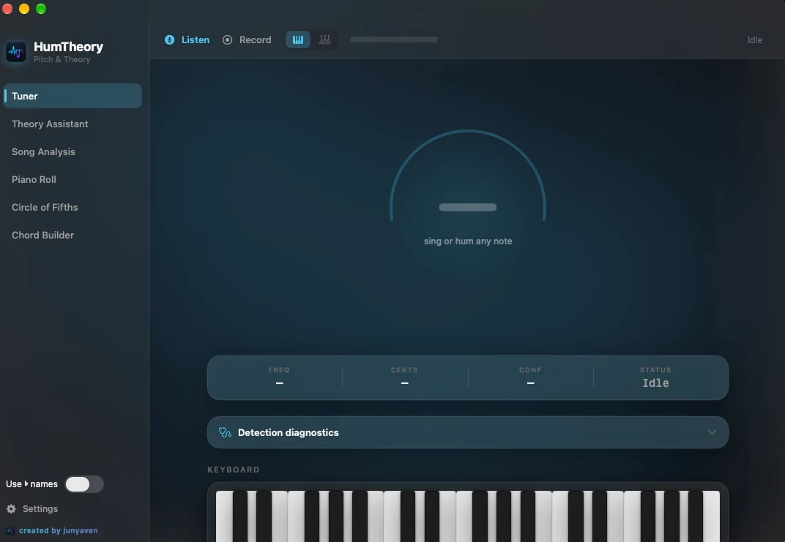
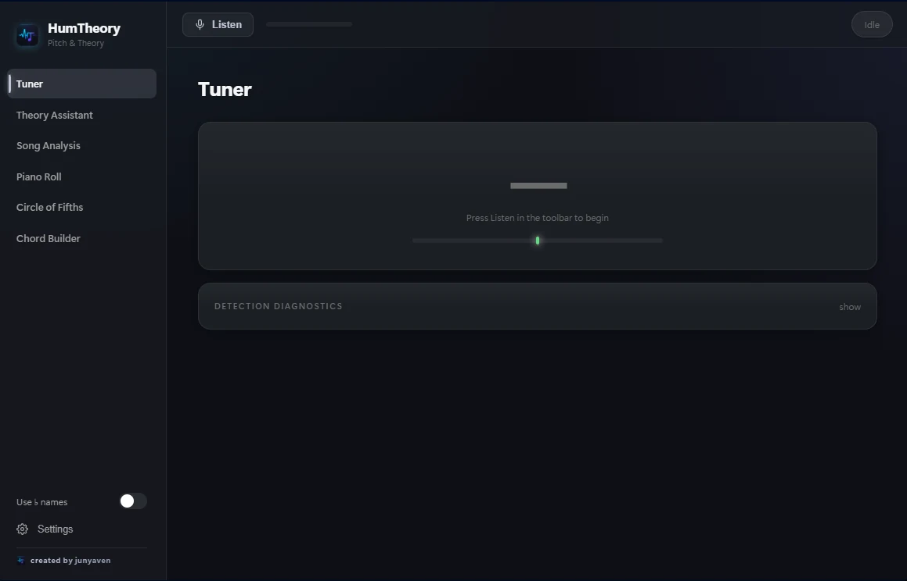

# HumTheory

> Hear. Analyze. Understand. Create.

HumTheory is a desktop music analysis and composition tool built for musicians who want to turn sounds and musical ideas into something they can actually work with.

Hum a melody. Play a chord. Drop in a song. HumTheory tries to figure out what's happening musically and gives you the notes, chords, keys, scales, progressions, and MIDI behind it.

**HumTheory is currently in beta.** Some features are still being worked on and certain results may be inaccurate, especially with noisy audio, dense mixes, or unusual musical material.

---

## What is HumTheory?

HumTheory is basically a bridge between actually making music and understanding what's going on.

The idea is simple:

```text
HEAR
  ↓
ANALYZE
  ↓
UNDERSTAND
  ↓
CREATE
  ↓
EXPORT
```

You can use it to:

- turn humming or singing into MIDI
- detect musical notes in real time
- identify chords and possible keys
- analyze songs and chord progressions
- generate chord progressions
- experiment with harmony and melodies
- explore scales, modes, intervals, and chord construction
- visualize music on a piano roll
- play chords on a virtual piano
- work with guitar chords and fretboard shapes
- export musical ideas as MIDI
- import MIDI on Windows
- inspect analyzed songs and their structure

The goal isn't to replace a DAW.

It's to help you get from **"i have this sound in my head"** to **"ok, now i can actually work with it."**

---

## Features

### Hum to MIDI

Hum or sing a melody into your microphone and HumTheory tracks the pitch in real time.

It can display:

- detected note
- octave
- frequency
- cents deviation
- confidence
- tuning information

The detected notes can then be turned into MIDI and displayed on the piano roll.

Pitch detection uses smoothing and confidence handling so small fluctuations don't constantly create new notes.

---

### Chord & Key Analysis

HumTheory can analyze notes and identify likely chords and keys.

It supports a wide range of chord types and can provide alternative interpretations when the result isn't completely obvious.

Instead of pretending every detection is 100% correct, HumTheory exposes confidence and treats analysis as an estimate.

---

### Song Analysis

Load an audio file and let HumTheory analyze it.

Supported formats include:

- MP3
- WAV
- FLAC
- M4A

Depending on the build and analysis available, HumTheory can estimate:

- BPM
- tempo
- key
- chords
- chord progression
- song sections
- rhythmic information

The goal is to turn a song into something you can actually inspect instead of just listening to it.

---

### Piano Roll

View detected melodies, generated progressions, and MIDI data in a piano-roll style interface.

The piano roll is used throughout HumTheory so musical information from different parts of the application can come together in one place.

> Note: piano-roll note editing is still a work in progress.

---

### Virtual Piano

Play notes and chords directly inside HumTheory.

The virtual piano can also be used alongside the analysis tools to visualize:

- detected notes
- chord tones
- scales
- musical ideas

---

### Guitar

HumTheory includes guitar-oriented tools for working with chords and musical ideas.

It can display playable chord shapes and fretboard positions, making it easier to take something found in the analyzer and actually play it on guitar.

---

### Progression Generator

Generate chord progressions based around musical parameters such as:

- key
- scale
- genre
- mood
- complexity

Generated progressions can be auditioned and explored further through HumTheory's other music tools.

---

### Music Theory

The theory tools are meant to be practical rather than a giant textbook.

You can inspect:

- notes
- intervals
- scales
- modes
- chords
- chord construction
- inversions
- key relationships
- Roman numeral analysis
- diatonic harmony
- compatible scales
- common progressions

Pick a key and HumTheory can show you the musical information around it.

---

### Circle of Fifths

The Circle of Fifths is interactive rather than just being a picture sitting in the application.

Selecting a key can be used to explore:

- major scale
- relative minor
- diatonic chords
- Roman numerals
- compatible modes
- common progressions

---

### MIDI

HumTheory works with standard MIDI data.

Current functionality includes:

- MIDI export
- MIDI playback
- piano-roll visualization
- MIDI import on Windows
- generated MIDI from melodies and progressions

MIDI is intended to make it easy to take an idea from HumTheory and continue working on it somewhere else.

---

## Platform Support

HumTheory currently has builds for:

### Windows

Windows is currently the more actively developing version.

The Windows build includes the core analysis and theory systems, along with MIDI import/export.

Some parts of the interface and feature set are still catching up with the macOS version.

### macOS

The macOS build is currently further along visually and includes some functionality that has not reached Windows yet.

The macOS version currently supports analyzed-song playback, while Windows support for this is still being developed.

---

## Beta

HumTheory is **not finished yet**.

It's currently a beta project, so things can break, detections can be wrong, and some features are still incomplete.

Music analysis is inherently imperfect too. A noisy microphone, dense song, unusual tuning, or ambiguous chord can throw the system off.

HumTheory tries to be honest about this by exposing confidence and alternative interpretations instead of pretending every result is certain.

Currently unfinished areas include things such as:

- HumTheory project saving/loading
- piano-roll note editing
- feature parity between Windows and macOS
- additional polish and refinement

These are actively being worked on.

---

## Privacy

HumTheory is designed as a local desktop application.

Audio processing is performed locally rather than uploading microphone recordings or songs to a cloud service.

No account is required to use the application.

---

## Development

HumTheory is being developed as a modular music-analysis application.

The major systems are separated conceptually into areas such as:

```text
Audio
Pitch Detection
Chord Detection
Song Analysis
Music Theory
MIDI
Guitar
Projects
UI
```

The idea is to keep the analysis systems independent from the interface so individual systems can be improved or replaced without rebuilding the entire application around them.

---

## Roadmap

Some of the things being worked toward include:

- improved pitch detection
- better chord recognition
- better song analysis
- improved Windows/macOS feature parity
- piano-roll editing
- project saving/loading
- better guitar arrangements
- improved MIDI workflows
- additional musical analysis tools
- performance and UI improvements

Longer term, the architecture could support things like:

- melody generation
- automatic accompaniment
- vocal harmonization
- stem analysis
- arrangement suggestions
- plugin integrations

Those aren't the focus of the current beta.

---

## Screenshots

### macOS



### Windows



More screenshots will be added as the different parts of the application develop.

---

## Running HumTheory

### Windows

The Windows build currently runs from the project source.

```bash
npm install
npm start
```

To build the Windows distribution:

```bash
npm run dist
```

### macOS

The macOS version currently requires:

- Apple Silicon
- macOS 14+
- Xcode

Open the Xcode project and run it from Xcode.

---

## Project Status

**Current status: BETA**

HumTheory is actively being developed.

The main focus right now is making the existing analysis tools reliable, improving the Windows version, and getting the different parts of the application to work together as one cohesive music workstation.

---

## License

License information will be added when the project's licensing terms are finalized.

---

<p align="center">
  <strong>HumTheory</strong><br>
  Hear. Analyze. Understand. Create.
</p>
